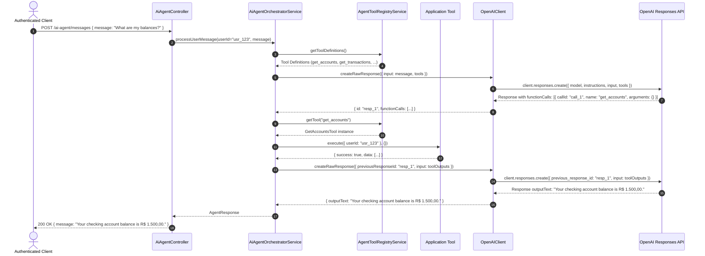

# FinBuddy AI Agent Architecture & Financial Read Tools Documentation

## 1. Executive Summary & Core Philosophy

The FinBuddy AI Agent module (`src/ai-agent/`) provides a secure, modular, and resilient foundation for an AI-powered personal financial assistant. It is built natively for NestJS 11 using TypeScript, Prisma, PostgreSQL 17, and the official OpenAI Node.js SDK (Responses API).

### Core Architectural Principles

1. **Vendor SDK Only (Zero Framework Bloat)**:
   - Built exclusively with the official `openai` SDK (`OpenAI`).
   - Avoids heavyweight or rapidly-shifting orchestration frameworks such as LangChain, LangGraph, or Vercel AI SDK. This ensures minimal attack surface, direct dependency control, strict TypeScript typing, and predictable runtime behavior.

2. **OpenAI Responses API Exclusively**:
   - Employs OpenAI's modern Responses API (`client.responses.create`), bypassing deprecated or legacy conversational completions abstractions.
   - Provides clean separation of static system instructions, dynamic user input, model configuration, and function tool definitions.

3. **Strict Layered Separation of Concerns**:
   - `AiAgentController` → `AiAgentService` → `AiAgentOrchestratorService` → `AgentToolRegistryService` → `Application Tool` → `Financial Service` → `Repository` → `PostgreSQL`.
   - Application services remain completely agnostic of underlying LLM transport and protocol nuances.

4. **Zero LLM Direct Database Access & Tenant Boundary**:
   - The LLM has zero direct access to Prisma repositories, raw SQL query executors, or database credentials.
   - Authenticated user identity (`userId`) originates solely from cryptographically verified JWT tokens.
   - The LLM cannot authorize requests or bypass domain ownership checks.

5. **Client-Safe Error Translation & Zero Secret Leakage**:
   - Upstream OpenAI rate limits, timeouts, service outages, tool errors, and iteration bounds are translated into standardized HTTP responses (`503 Service Unavailable`, `400 Bad Request`, `401 Unauthorized`).
   - API keys, raw upstream error stacks, internal database details, and system instructions are never exposed to clients.

---

## 2. Layered Architecture & Request Flow

```text
User
  ↓
JWT Authentication
  ↓
AiAgentController
  ↓
AiAgentService
  ↓
AiAgentOrchestratorService
  ↓
OpenAI Responses API
  ↓
tool_call
  ↓
AgentToolRegistryService
  ↓
Application Tool (get_accounts / get_transactions / get_financial_summary / get_budgets)
  ↓
Existing Financial Service (AccountService / TransactionService / FinancialSummaryService / BudgetService)
  ↓
Repository
  ↓
PostgreSQL
  ↓
Tool Result
  ↓
OpenAI Responses API
  ↓
Final Assistant Response
```

### Component Responsibilities

| Component | Layer | Path | Responsibility |
|---|---|---|---|
| `AiAgentController` | Presentation | `src/ai-agent/ai-agent.controller.ts` | Exposes `POST /ai-agent/messages`, enforces `JwtAuthGuard`, validates DTO payloads, strips unwhitelisted fields, and maps domain responses to `AgentResponseDto`. |
| `AiAgentService` | Application | `src/ai-agent/ai-agent.service.ts` | Primary application boundary service. Records metrics counters (`ai_requests_total`, `ai_requests_success_total`) and measures request duration. |
| `AiAgentOrchestratorService` | Orchestration | `src/ai-agent/application/ai-agent-orchestrator.service.ts` | Coordinates the tool-calling loop, enforces `MAX_TOOL_ITERATIONS = 5`, executes registered tools, sends tool outputs back to OpenAI, and formats `AgentResponse`. |
| `AgentToolRegistryService` | Tooling Registry | `src/ai-agent/application/tools/agent-tool-registry.service.ts` | Centralized registry discovering executable tools, converting schemas to OpenAI format, and resolving tools by exact string name. Prevents arbitrary method execution. |
| `GetAccountsTool` | Application Tool | `src/ai-agent/application/tools/impl/get-accounts.tool.ts` | Read-only tool `get_accounts`. Retrieves user accounts and current balances by invoking `AccountService.findByUserId`. |
| `GetTransactionsTool` | Application Tool | `src/ai-agent/application/tools/impl/get-transactions.tool.ts` | Read-only tool `get_transactions`. Retrieves transaction history with optional filters (`accountId`, `limit`, `offset`) by invoking `TransactionService.findByUserId`. |
| `GetFinancialSummaryTool` | Application Tool | `src/ai-agent/application/tools/impl/get-financial-summary.tool.ts` | Read-only tool `get_financial_summary`. Retrieves monthly financial summary with optional `month` (YYYY-MM) by invoking `FinancialSummaryService.getSummary`. |
| `GetBudgetsTool` | Application Tool | `src/ai-agent/application/tools/impl/get-budgets.tool.ts` | Read-only tool `get_budgets`. Retrieves budgets and spending calculations with optional filters (`categoryId`, `month`) by invoking `BudgetService.findByUserId`. |
| `OpenAIClient` | Infrastructure | `src/ai-agent/infrastructure/openai/openai.client.ts` | Manages lazy instantiation of official `OpenAI` SDK client, injects timeout configurations (`OPENAI_TIMEOUT_MS`), handles multi-turn `previous_response_id`, and parses function calls. |
| `FINBUDDY_AGENT_INSTRUCTIONS` | Domain / Policy | `src/ai-agent/application/prompts/finbuddy-agent.instructions.ts` | System prompt defining FinBuddy's persona, anti-hallucination rules, financial tool dependencies, and non-authoritative execution safeguards. |

---

## 3. Read-Only Financial Tools

FinBuddy implements exactly four read-only tools for the AI Agent:

### 3.1 `get_accounts`
- **Purpose**: Retrieve the authenticated user's financial accounts and current balances.
- **Input Schema**: `{ type: "object", properties: {}, additionalProperties: false }`
- **Reused Domain Layer**: `AccountService.findByUserId(context.userId)`
- **Authorization**: User identity is passed strictly from `AgentToolContext.userId`. `userId` is never accepted as a model input parameter.

### 3.2 `get_transactions`
- **Purpose**: Retrieve the authenticated user's transaction history using optional filters.
- **Input Schema**:
  ```json
  {
    "type": "object",
    "properties": {
      "accountId": { "type": "string", "description": "Optional account UUID filter" },
      "limit": { "type": "integer", "minimum": 1, "maximum": 100, "description": "Maximum number of transactions to return (1-100)" },
      "offset": { "type": "integer", "minimum": 0, "description": "Number of transactions to skip for pagination" }
    },
    "additionalProperties": false
  }
  ```
- **Reused Domain Layer**: `TransactionService.findByUserId(context.userId, { accountId, limit, offset })`
- **Authorization & Ownership**: If `accountId` is specified by the model, `TransactionService` verifies that the account is owned by `context.userId`. Cross-user access returns a safe error (`Account not found`) and zero financial data.

### 3.3 `get_financial_summary`
- **Purpose**: Retrieve the authenticated user's financial summary for a calendar month.
- **Input Schema**:
  ```json
  {
    "type": "object",
    "properties": {
      "month": { "type": "string", "pattern": "^\\d{4}-(0[1-9]|1[0-2])$", "description": "Calendar month in YYYY-MM format" }
    },
    "additionalProperties": false
  }
  ```
- **Reused Domain Layer**: `FinancialSummaryService.getSummary(context.userId, { month })`
- **Data Returned**: Returns monthly total income, total expenses, net income, account balances, category breakdowns, and budget spending.

### 3.4 `get_budgets`
- **Purpose**: Retrieve the authenticated user's budgets and current spending information.
- **Input Schema**:
  ```json
  {
    "type": "object",
    "properties": {
      "categoryId": { "type": "string", "description": "Optional category UUID filter" },
      "month": { "type": "string", "pattern": "^\\d{4}-(0[1-9]|1[0-2])$", "description": "Optional target month in YYYY-MM format" }
    },
    "additionalProperties": false
  }
  ```
- **Reused Domain Layer**: `BudgetService.findByUserId(context.userId, { categoryId, month })`
- **Data Returned**: Budget limits, calculated spending, remaining balances, and percentage used.

> [!IMPORTANT]
> Write operations (`create_account`, `update_account`, `delete_account`, `create_transaction`, `update_transaction`, `delete_transaction`, `create_transfer`, `delete_transfer`, `create_budget`, `update_budget`, `delete_budget`) are NOT implemented in the agent registry. No financial write tool is reachable by the model.

---

## 4. Authorization & Security Boundaries

```text
LLM ≠ authorization layer
LLM ≠ database layer
LLM ≠ financial source of truth
```

### 4.1 Application Authorization Authority
1. **Model Output Untrusted**: Model outputs (including tool arguments such as `accountId`, `categoryId`, `month`) are strictly untrusted parameters.
2. **Context-Driven User Ownership**: User identity (`userId`) comes solely from the authenticated request JWT context.
3. **IDOR Prevention**: If a model supplies a target UUID (e.g. `accountId`), application services enforce database ownership (`where: { id, userId }`). If unauthorized, services throw `NotFoundException`, which tool wrappers handle safely without leaking cross-user existence.

### 4.2 Tool Registry Execution Boundary
- Resolves tools by exact name match against registered `AgentTool` objects.
- Rejects unknown tools cleanly (`{ success: false, error: "Unknown tool: ..." }`).
- Prevents arbitrary method execution, dynamic reflection, class loading, or arbitrary service invocation based on model string output.

### 4.3 Anti-Hallucination Policy
- FinBuddy instructions prohibit fabricating financial numbers.
- Financial facts must originate from executed read tools.
- If a tool fails or data is missing, FinBuddy informs the user that the requested information could not be retrieved.

---

## 5. Tool-Calling Loop & Iteration Bounds



### Hard Bound Execution Limit
- `MAX_TOOL_ITERATIONS = 5`.
- If the model attempts to execute tools indefinitely, execution terminates after 5 iterations.
- A metric (`ai_tool_max_iterations_reached_total`) is incremented, an error is logged, and a `503 Service Unavailable` response is returned.

---

## 6. Current Limitations & Roadmap

### Current Limitations
- **No Write Tools**: Financial mutations (create/update/delete) are not exposed to the agent.
- **No Confirmation Flow**: Two-step human confirmation workflows for write tools are not implemented in this phase.
- **No Conversation Persistence**: Endpoint is stateless for now; conversation history is not saved in a database across HTTP requests.
- **No Memory / RAG**: No vector embeddings, RAG, long-term memory, or Redis memory persistence.
- **Guardrails**: Comprehensive prompt injection defense harness and guardrails belong to dedicated future phases (hard boundary currently enforced at application auth & registry layers).
- **Evaluation Harness**: No automated benchmark evaluation harness for LLM response quality yet.
- **Advanced Observability**: Detailed token-level LLM cost and trace analytics belong to future phases.

### Phase Roadmap

| Phase | Milestone | Status |
|---|---|---|
| **Phase 1** | **AI Agent Foundation** | **Completed** |
| **Phase 2** | **Financial Read Tools & Tool-Calling Loop** | **Completed** |
| **Phase 3** | **Conversational Memory & State** | Planned |
| **Phase 4** | **Confirmed Financial Mutations** | Planned |
| **Phase 5** | **Guardrails & Evaluation Harness** | Planned |
