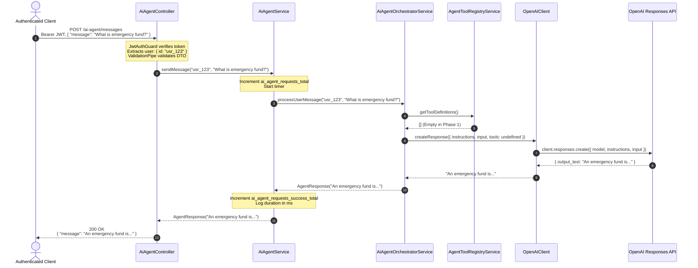
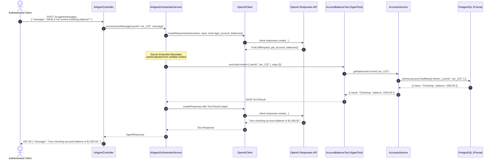

# FinBuddy AI Agent Foundation — Architecture & Operational Documentation

## 1. Executive Summary & Core Philosophy

The FinBuddy AI Agent module (`src/ai-agent/`) provides a secure, modular, and resilient foundation for an AI-powered personal financial assistant. It is built natively for NestJS 11 using TypeScript, Prisma, and the official OpenAI Node.js SDK.

### Core Architectural Principles

1. **Vendor SDK Only (Zero Framework Bloat)**:
   - Built exclusively with the official `openai` SDK (`OpenAI`).
   - Avoids heavyweight, opaque, or rapidly-shifting orchestration frameworks such as LangChain, LangGraph, or Vercel AI SDK. This ensures minimal attack surface, direct dependency control, strict TypeScript typing, and predictable runtime behavior.

2. **OpenAI Responses API Exclusively**:
   - Employs OpenAI's modern Responses API (`client.responses.create`), bypassing deprecated or legacy conversational abstractions.
   - Provides a clean separation of static system instructions, dynamic user input, model configuration, and structured tool definitions.

3. **Strict Layered Separation of Concerns**:
   - `AiAgentController` → `AiAgentService` → `AiAgentOrchestratorService` → `AgentToolRegistryService` → `OpenAIClient`.
   - Application services remain completely agnostic of underlying LLM transport and protocol nuances.

4. **Zero LLM Direct Database Access & Tenant Boundary**:
   - The LLM has zero direct access to Prisma repositories, raw SQL query executors, or database credentials.
   - Authenticated user identity (`userId`) originates solely from cryptographically verified JWT tokens.

5. **Client-Safe Error Translation & Zero Secret Leakage**:
   - Upstream OpenAI rate limits, timeouts, service outages, and authentication issues are translated into standardized HTTP `503 Service Unavailable` responses.
   - API keys, raw upstream error stacks, and internal agent prompt instructions are never exposed to clients or logged in unredacted stdout.

---

## 2. Layered Architecture & Request Flow

The AI Agent module follows a strictly decoupled, uni-directional flow across presentation, application, domain, and infrastructure boundaries.

```
                    ┌──────────────────────────────────────────────┐
                    │          HTTP Client (Authenticated)         │
                    └──────────────────────┬───────────────────────┘
                                           │ POST /ai-agent/messages
                                           │ Bearer JWT + { message }
                                           ▼
                    ┌──────────────────────────────────────────────┐
                    │              AiAgentController               │
                    │   - JwtAuthGuard & @CurrentUser()            │
                    │   - SendAgentMessageDto validation           │
                    └──────────────────────┬───────────────────────┘
                                           │ sendMessage(userId, message)
                                           ▼
                    ┌──────────────────────────────────────────────┐
                    │               AiAgentService                 │
                    │   - Metrics (ai_agent_requests_total)        │
                    │   - Execution duration timing                │
                    │   - Correlation & audit logging              │
                    └──────────────────────┬───────────────────────┘
                                           │ processUserMessage(userId, message)
                                           ▼
                    ┌──────────────────────────────────────────────┐
                    │         AiAgentOrchestratorService           │
                    │   - FINBUDDY_AGENT_INSTRUCTIONS              │
                    │   - Tool definitions query                   │
                    │   - Model & parameters configuration         │
                    └──────────────┬──────────────────────┬────────┘
                                   │                      │
                   getToolDefinitions()                   │ createResponse(...)
                                   │                      │
                                   ▼                      ▼
┌────────────────────────────────────────┐  ┌──────────────────────────────────────┐
│        AgentToolRegistryService        │  │             OpenAIClient             │
│   - In-memory tool registry (Map)      │  │   - ConfigService (API Key, timeout) │
│   - AgentTool interface validation     │  │   - client.responses.create(...)     │
│   - Schema serialization               │  │   - Error normalization (503)        │
└────────────────────────────────────────┘  └──────────────────┬───────────────────┘
                                                               │
                                                               │ HTTPS (TLS 1.3)
                                                               ▼
                                            ┌──────────────────────────────────────┐
                                            │         OpenAI Responses API         │
                                            │             (gpt-5.5)                │
                                            └──────────────────────────────────────┘
```

### Component Responsibilities

| Component | Layer | Path | Responsibility |
|---|---|---|---|
| `AiAgentController` | Presentation | `src/ai-agent/ai-agent.controller.ts` | Exposes `POST /ai-agent/messages`, enforces `JwtAuthGuard`, validates DTO payloads, strips unwhitelisted fields, and maps domain responses to `AgentResponseDto`. |
| `AiAgentService` | Application | `src/ai-agent/ai-agent.service.ts` | Primary application boundary service. Records metrics counters (`ai_agent_requests_total`, `ai_agent_requests_success_total`, `ai_agent_requests_failure_total`) and measures request duration. |
| `AiAgentOrchestratorService` | Orchestration | `src/ai-agent/application/ai-agent-orchestrator.service.ts` | Assembles agent instructions, binds tool definitions from the registry, coordinates prompt execution with `OpenAIClient`, and constructs `AgentResponse`. |
| `AgentToolRegistryService` | Tooling | `src/ai-agent/application/tools/agent-tool-registry.service.ts` | Centralized registry for tool definitions. In this foundation phase, maintains an empty registry ready for subsequent financial tool registrations. |
| `OpenAIClient` | Infrastructure | `src/ai-agent/infrastructure/openai/openai.client.ts` | Manages lazy instantiation of the official `OpenAI` SDK client, injects timeout configurations (`OPENAI_TIMEOUT_MS`), verifies API key presence, and catches upstream failures. |
| `FinBuddyAgentInstructions` | Domain / Policy | `src/ai-agent/application/prompts/finbuddy-agent.instructions.ts` | System prompt defining FinBuddy's persona, boundaries, anti-hallucination rules, and non-authoritative financial execution safeguards. |

---

## 3. OpenAI-Only Architecture & Responses API Decision

### Why OpenAI SDK Direct?
- **Zero Abstraction Leaks**: Direct use of the official `openai` package eliminates third-party compatibility delays, breaking API changes from intermediary wrappers, and runtime memory overhead.
- **Auditability & Observability**: Every parameter sent to the model is explicitly visible in code rather than hidden behind complex chain or agent graphs.
- **Security Control**: Directly controlling HTTP request construction and client lifecycle avoids accidental prompt leakage or unvetted telemetries from third-party frameworks.

### Why OpenAI Responses API (`client.responses.create`)?
FinBuddy uses the **OpenAI Responses API** instead of legacy Chat Completions (`client.chat.completions.create`) or Assistants API:
1. **Clean Input Separation**: Explicitly separates static, immutable system policies (`instructions`) from dynamic user prompts (`input`).
2. **First-Class Tool Declarations**: Accepts structured tool schemas natively without complex message role gymnastics (`tools: [{ type: 'function', ... }]`).
3. **Streamlined Response Model**: Returns direct text output (`response.output_text`), simplifying downstream response mapping and reducing parsing ambiguities.
4. **Future-Proof**: Responses API is OpenAI's flagship conversational and agentic interface, designed for tool calling, structured outputs, and multimodal interactions.

---

## 4. Sequence Diagrams

### 4.1 Current Foundation Request Flow (Phase 1)

The current phase executes a single-turn, stateless financial query without tool execution:



### 4.2 Future Tool Execution Flow (Phase 2 & Beyond)

When financial query tools (e.g., `get_account_balances`) are registered, the orchestrator acts as a secure intermediary between the LLM and the application service layer:



---

## 5. Security & User Identity Isolation Boundary

### 5.1 Tenant Isolation & Authentication Context
FinBuddy operates under strict multi-tenant isolation. The AI Agent enforces these non-negotiable boundaries:
1. **JWT-Derived Identity Only**: The authenticated user's ID (`userId`) is extracted exclusively from the validated JWT payload (`@CurrentUser()`).
2. **Mass Assignment Rejection**: Any attempt by a client to submit a `userId`, `role`, or administrative flag within the JSON request body is automatically rejected with HTTP `400 Bad Request` by NestJS `ValidationPipe` (`forbidNonWhitelisted: true`).
3. **No Cross-Tenant Context Bleed**: The `userId` passed to internal services is guaranteed to match the requesting subject. When tools are introduced, queries will always enforce `where: { userId }` at the database level.

### 5.2 Zero Direct Database Access for LLM
- **No SQL Generation**: The LLM is never provided with raw database connection strings, Prisma client instances, or arbitrary SQL execution tools.
- **Strict Gateway Pattern**: All financial state reads and mutations must pass through strongly-typed NestJS application services and domain validation rules. The LLM can only suggest or request predefined, parameterized tool invocations.

### 5.3 Agent Persona & Anti-Hallucination Directives
The agent's system instructions (`FINBUDDY_AGENT_INSTRUCTIONS`) enforce strict behavioral invariants:
- **No Fabricated Financial Data**: If financial records or balances are not provided or tools are unavailable, the agent must explicitly state that it does not have access to that information.
- **Guidance vs. Operations**: The agent clearly differentiates between general financial explanations (e.g., budgeting principles, interest calculation concepts) and actual account operations.
- **No Implicit Execution**: The agent will never claim to have executed transfers, transactions, or account changes without an explicit underlying system confirmation.

---

## 6. Tool Registry Architecture

The tool architecture resides in `src/ai-agent/application/tools/` and is designed for progressive expansion.

### Tool Interface (`agent-tool.interface.ts`)
```typescript
export interface AgentToolContext {
  userId: string;
}

export interface AgentTool {
  name: string;
  description: string;
  parameters: Record<string, any>;
  execute(context: AgentToolContext, args: Record<string, any>): Promise<any>;
}
```

### Registry Service (`agent-tool-registry.service.ts`)
The `AgentToolRegistryService` maintains an in-memory map of registered tools:
- `registerTool(tool: AgentTool): void`: Registers a strongly-typed tool.
- `getTool(name: string): AgentTool | undefined`: Retrieves a tool by its unique name.
- `getTools(): AgentTool[]`: Returns all currently registered tools.
- `getToolDefinitions(): any[]`: Serializes tools into OpenAI function declaration format:
  ```json
  {
    "type": "function",
    "name": "tool_name",
    "description": "Tool purpose...",
    "parameters": { ... }
  }
  ```

### Phase 1 Registry Status
In the current foundation phase, the registry is intentionally **empty**. No tools are exposed to OpenAI, guaranteeing that the model cannot attempt function invocations until dedicated financial tool services are audited and registered in Phase 2.

---

## 7. Error Handling & Zero-Leakage Rules

### Upstream Failure Normalization
Any exception thrown during communication with OpenAI (e.g., network timeout, upstream 500 error, HTTP 429 rate limit exceeded, missing configuration) is intercepted by `OpenAIClient`:

```typescript
try {
  const response = await client.responses.create({ ... });
  if (!response || !response.output_text) {
    throw new ServiceUnavailableException('Invalid response from AI provider');
  }
  return response.output_text;
} catch (error) {
  if (error instanceof ServiceUnavailableException) {
    throw error;
  }
  const message = error instanceof Error ? error.message : String(error);
  this.logger.error(`OpenAI Responses API call failed: ${message}`);
  throw new ServiceUnavailableException('AI service temporarily unavailable');
}
```

### Client Response Guarantees
1. **Sanitized HTTP 503**: Clients always receive a sanitized, consistent error payload:
   ```json
   {
     "statusCode": 503,
     "message": "AI service temporarily unavailable",
     "requestId": "2b6d5117-910a-471a-a1e4-fcfa26e2e0ea"
   }
   ```
2. **Missing Configuration Safety**: If `OPENAI_API_KEY` is not provided in environment variables, the endpoint fails gracefully with:
   ```json
   {
     "statusCode": 503,
     "message": "AI service is not configured",
     "requestId": "correlated-uuid"
   }
   ```
3. **Zero Secret & Stack Leakage**:
   - `OPENAI_API_KEY` and raw headers are never logged or returned.
   - Internal stack traces are suppressed from HTTP responses by `AllExceptionsFilter`.
   - Internal system prompt instructions (`FINBUDDY_AGENT_INSTRUCTIONS`) are never included in error bodies.

---

## 8. Privacy, Logging & Observability

### User Data & Prompt Privacy
- **No Prompt Logging**: Dynamic user prompt bodies (`dto.message`) and raw AI responses are deliberately omitted from standard HTTP request access logs (`RequestLoggingMiddleware`).
- **Audit Logging**: Application logs record only operational metadata:
  ```text
  [AiAgentService] [user:usr_123] AI Agent message processed in 342ms
  ```

### Metrics Counters (`MetricsService`)
The AI agent publishes three dedicated in-memory metrics counters:
- `ai_agent_requests_total`: Total inbound agent requests received at the service layer.
- `ai_agent_requests_success_total`: Total requests that successfully generated an AI response.
- `ai_agent_requests_failure_total`: Total requests that failed due to upstream outages, missing config, or unexpected errors.

### Request Correlation
Every request carries an `X-Request-Id` header (auto-generated UUID v4 if omitted by client). This identifier is propagated across all log entries, HTTP response headers, and exception payloads.

---

## 9. API Specification

### Endpoint: `POST /ai-agent/messages`

- **Authentication**: Required (`Bearer <JWT>`)
- **Content-Type**: `application/json`
- **Rate Limiting**: Protected by global `RateLimitGuard` (`ThrottlerGuard`).

#### Request Payload (`SendAgentMessageDto`)
```json
{
  "message": "Can you explain how budgeting 50/30/20 works?"
}
```

| Field | Type | Required | Constraints | Description |
|---|---|---|---|---|
| `message` | `string` | Yes | 1 to 2000 characters, non-empty | User query or prompt for the assistant. |

#### Successful Response (`200 OK`)
```json
{
  "message": "The 50/30/20 budgeting framework divides your after-tax income into three buckets: 50% for Needs, 30% for Wants, and 20% for Savings or Debt Paydown..."
}
```

#### Error Responses
- `400 Bad Request`: Payload validation failed (e.g. missing message, oversized message >2000 chars, unexpected extra fields).
- `401 Unauthorized`: Missing, invalid, or expired JWT Bearer token.
- `429 Too Many Requests`: Rate limit threshold exceeded.
- `503 Service Unavailable`: AI service unconfigured or OpenAI upstream temporarily unreachable.

---

## 10. Configuration Reference

Environment variables configured in `src/config/env.validation.ts` and `.env.example`:

| Variable | Type | Default | Required | Description |
|---|---|---|---|---|
| `OPENAI_API_KEY` | `string` | `undefined` | Optional at startup (Required at runtime when calling AI endpoints) | OpenAI API Secret Key (`sk-...`). |
| `OPENAI_MODEL` | `string` | `gpt-5.5` | No | Target OpenAI model identifier. |
| `OPENAI_TIMEOUT_MS` | `number` | `30000` | No | Upstream HTTP timeout in milliseconds (default 30 seconds). |

---

## 11. Current Limitations & Roadmap

### Current Limitations (Phase 1)
- **Stateless Single-Turn**: Each message is processed independently. Conversation history is not stored across requests.
- **No Direct Financial Querying**: The agent cannot inspect user transactions, balances, or budgets because tool execution is disabled until Phase 2.
- **Text Only**: No support for file uploads, financial statement PDFs, or image inputs.

### Roadmap

| Phase | Milestone | Scope | Status |
|---|---|---|---|
| **Phase 1** | **AI Agent Foundation** | OpenAI SDK, Responses API, JWT Context Binding, Empty Tool Registry, Error Normalization, E2E Suite. | **Completed** |
| **Phase 2** | **Read-Only Financial Tools** | Register read tools (`get_accounts`, `get_transactions`, `get_budget_status`) with strict tenant isolation. | Planned |
| **Phase 3** | **Conversational Memory** | Multi-turn conversational memory with user session persistence and thread management. | Planned |
| **Phase 4** | **Confirmed Financial Mutations** | Interactive tool execution for categorization corrections and budget adjustments with 2-step confirmation. | Planned |
